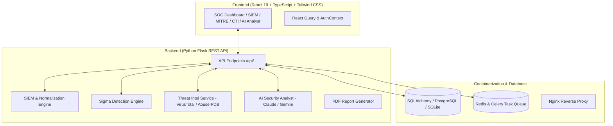

# SentinelX – AI-Powered Security Operations Center (SOC) Simulation Platform

[](https://github.com/aswinkarthikv/AI-Powered-Security-Operations-Center-SOC-Platform)
[](https://react.dev/)
[](https://www.typescriptlang.org/)
[](https://flask.palletsprojects.org/)
[](https://www.docker.com/)
[](LICENSE)

**SentinelX** is a production-grade, enterprise Security Operations Center (SOC) simulation platform engineered to replicate modern cyber defense infrastructure used by leading technology companies and security providers such as **CrowdStrike, Palo Alto Networks, Splunk, Amazon, Microsoft, and Google**.

---

## Key Features

### 🛡️ Enterprise SIEM Simulation Engine
- **Real-Time Log Pipeline**: Ingests, parses, and normalizes logs across 6 enterprise sources:
  - **Windows Event Logs**: Event ID 4624 (Successful Logon), 4625 (Failed Logon), 4688 (Process Spawn), 4672 (Admin Privileges).
  - **Linux Syslog / auth.log**: SSH publickey acceptances, pam_unix authentication failures.
  - **Network Firewalls**: Cisco ASA / Fortinet rule match drop/allow events.
  - **IDS / IPS**: Snort & Suricata rule signature alerts.
  - **Web Application Servers**: Nginx / Apache access logs with SQL Injection and XSS signatures.
  - **Cloud Infrastructure**: AWS CloudTrail console login & IAM policy changes.
- **Normalization Pipeline**: Normalizes raw payloads into **ECS (Elastic Common Schema)** and **CEF** JSON standard formats.
- **Attack Simulator Engine**: Live attack simulation injections for **Brute Force**, **Port Scanning**, **SQL Injection**, and **Ransomware Mass Encryption**.

---

### 🔍 Sigma & Custom Detection Rules Engine
- **Sigma Rule Parser**: Supports standard YAML-defined Sigma rules for cross-platform threat signatures.
- **Custom Rule Builder**: Threshold-based and regex detection rule creation interface.
- **Automated Rule Triggers**: Live matching triggers instant Security Alerts and auto-creates high-priority Incidents.

---

### 🎯 MITRE ATT&CK Framework Integration
- **Interactive ATT&CK Matrix Grid**: Real-time matrix view covering Initial Access, Execution, Persistence, Privilege Escalation, Defense Evasion, Credential Access, Discovery, Lateral Movement, Exfiltration, and Impact.
- **Matrix Coverage Calculator**: Dynamically calculates active rule coverage percentage.
- **Attack Kill Chain Visualizer**: Visualizes multi-stage adversary campaign execution flows.

---

### 🌐 Threat Intelligence Engine (CTI)
- **IOC Search Utility**: Instant search for **IP Addresses**, **Domains**, **URLs**, and **File Hashes (MD5/SHA256)**.
- **API Feed Integration**: Interfaced with **VirusTotal**, **AbuseIPDB**, and **AlienVault OTX**.
- **CTI Profile Display**: Reputation score dial (0-100), risk level rating, malware family attribution, known threat actor mapping (e.g. APT29, Lazarus Group, FIN7), and WHOIS geolocation.

---

### 🤖 AI Security Analyst (Claude & Gemini API)
- **Interactive AI Assistant Drawer**: Cyberpunk conversational workbench powered by Anthropic Claude 3.5 Sonnet / Gemini API with SOC expert fallback mode.
- **Automated Playbook Generation**: Generates immediate host containment scripts:
  - Linux `iptables` and `ufw` block commands
  - Windows PowerShell `New-NetFirewallRule` commands
  - EDR host isolation playbooks
- **Executive Alert Summaries**: Translates technical log payloads into clear executive briefs.

---

### 📋 Incident Response Workflow Board
- **Lifecycle Kanban Board**: Manage incidents across `New` ➔ `Assigned` ➔ `Investigating` ➔ `Contained` ➔ `Resolved` ➔ `Closed`.
- **Evidence Locker**: Captured PCAP snippets, log artifacts, and IOC hashes.
- **SLA Countdown Timers**: Automated SLA tracking (P1 Critical: 15m, P2 High: 1h).
- **Incident Timeline & Analyst Thread**: Chronological audit timeline and collaborative notes.

---

### 📊 Executive Reports & PDF Export
- **Report Generator**: Daily SOC Report, Weekly Operational Brief, Executive CTI Brief, Incident Post-Mortem.
- **PDF Export Engine**: Built-in ReportLab binary PDF generator for compliance and management reviews.

---

## System Architecture



---

## Technology Stack

| Layer | Technology |
| :--- | :--- |
| **Frontend** | React 19, TypeScript, Vite, Tailwind CSS, TanStack React Query v5, React Router v7, Chart.js, Lucide Icons, Framer Motion |
| **Backend** | Python 3.14, Flask REST API, SQLAlchemy ORM, Flask-JWT-Extended, PyYAML, ReportLab |
| **Database & Cache** | PostgreSQL, SQLite, Redis |
| **Deployment** | Docker, Docker Compose, Nginx, Gunicorn |
| **CI/CD** | GitHub Actions Workflow |

---

## Quickstart Setup

### Option 1: Docker Compose (Recommended)

```bash
# Clone the repository
git clone https://github.com/aswinkarthikv/AI-Powered-Security-Operations-Center-SOC-Platform.git
cd AI-Powered-Security-Operations-Center-SOC-Platform

# Start containers via Docker Compose
docker-compose up -d --build

# Platform Endpoints:
# Frontend: http://localhost
# Backend API: http://localhost:5000
# OpenAPI / Swagger Docs: http://localhost:5000/api/docs
```

### Option 2: Local Development Setup

#### Backend Setup
```bash
cd backend
python -m venv venv
# On Linux/macOS: source venv/bin/activate
# On Windows: venv\Scripts\activate
pip install -r requirements.txt
python run.py
```

#### Frontend Setup
```bash
cd frontend
npm install
npm run dev
# Access UI on http://localhost:3000
```

---

## Default Demo Credentials

| Role | Username | Password |
| :--- | :--- | :--- |
| **Admin** | `admin` | `Admin@123` |
| **SOC Analyst** | `analyst_karthik` | `Analyst@123` |

---

## License

This project is licensed under the [MIT License](LICENSE).

Developed by **Aswin Karthik** — Portfolio Quality SDE / Security Operations Center Simulation Platform.
