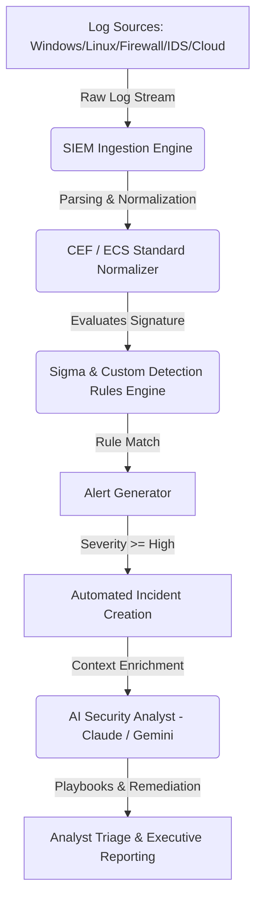

# SentinelX Architecture & System Design

## Overview
SentinelX is a production-ready Security Operations Center (SOC) simulation platform engineered to replicate modern enterprise cyber defense pipelines used by companies such as CrowdStrike, Palo Alto Networks, Splunk, Amazon, and Microsoft.

## Data Ingestion & Detection Pipeline

## Core Subsystems
1. **SIEM Simulation Engine**: Generates real-time events across 6 source categories (Windows Event ID 4624/4625, Linux Syslog/auth.log, ASA Firewall, Snort/Suricata IDS, Nginx Web Server, AWS CloudTrail).
2. **Sigma Rule Engine**: Evaluates YAML-defined detection rules matching signatures for Brute Force, Port Scanning, SQL Injection, XSS, Ransomware, Phishing, Privilege Escalation, and Exfiltration.
3. **MITRE ATT&CK Framework**: Maps all alert indicators to MITRE techniques and calculates real-time enterprise matrix coverage percentage.
4. **Threat Intelligence Engine**: Interfaces with VirusTotal, AbuseIPDB, and AlienVault OTX feeds for IP, Domain, Hash, and URL CTI lookups.
5. **AI Security Analyst**: Interactive agent powered by Anthropic Claude 3.5 Sonnet / Gemini API generating root-cause analysis, containment bash/powershell scripts, and executive summaries.
